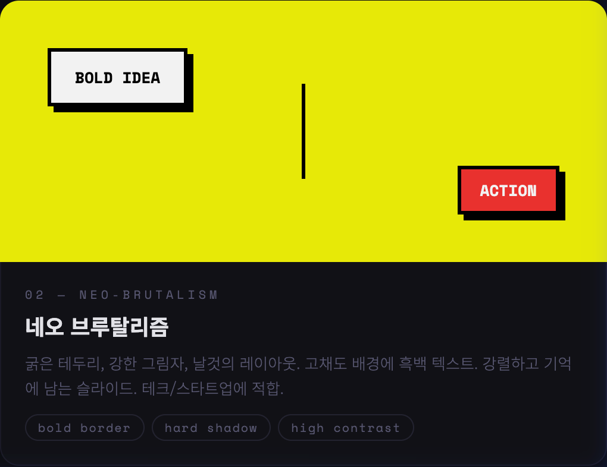
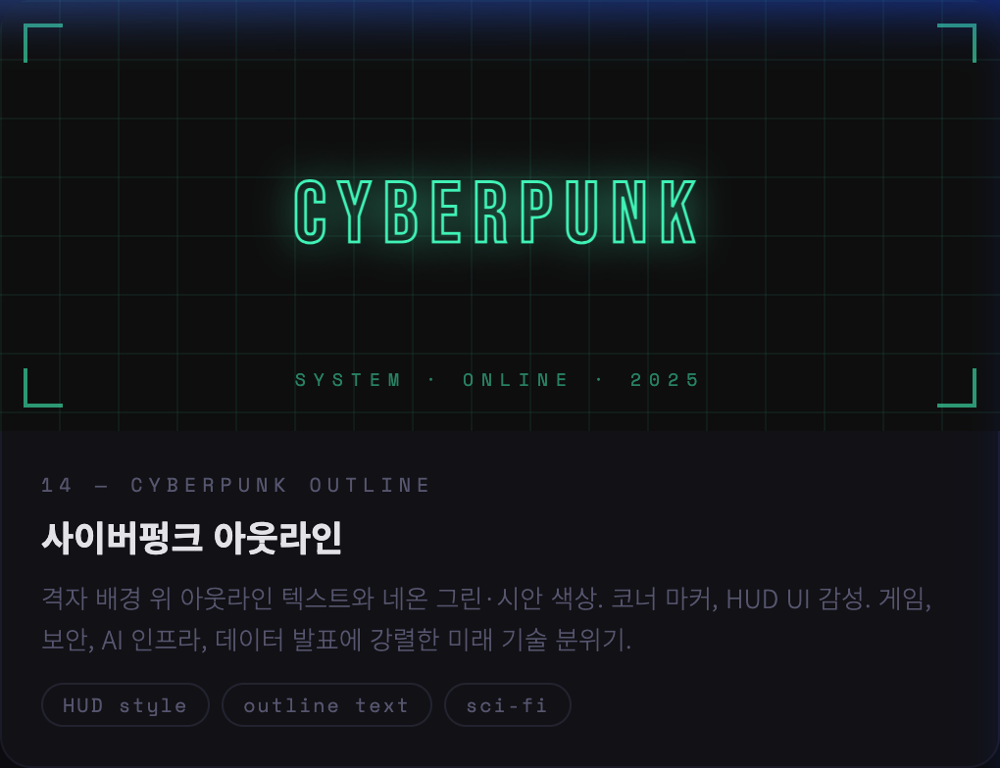
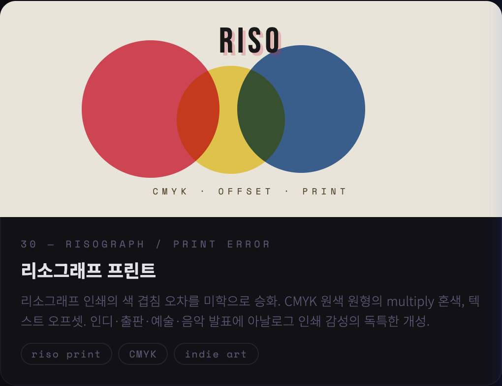

# 🎨 PPTX Modern Design Styles Skill

[English](README.md) | [한국어](README_ko.md) | [Design Preview 🌈](https://corazzon.github.io/pptx-design-styles/preview/modern-pptx-designs-30.html)

> A Claude.ai skill for creating visually stunning presentations — 30 modern design styles included

---

## Overview

This skill enables Claude.ai to apply **30 curated modern design styles** when generating PPTX presentations. Each style includes precise **HEX color values, font pairings, layout rules, and signature elements** so every deck looks intentionally designed.

---

## 🚀 How to Use

This section guides you on how to set up and use this design skill across different AI platforms.

### 1. Claude.ai (Projects)
Turn Claude into your personal presentation design expert using the Projects feature.
- **Setup**: 
  1. Create a new **Project** in Claude.ai.
  2. Upload `SKILL.md` and `references/styles.md` to the **Project Knowledge**.
- **Usage**: Ask in the project chat, e.g., "Create an outline for a PPTX deck". Claude will reference the knowledge base to apply the most optimal design from the 30 themes.

### 2. Gemini Antigravity (Local Skill)
Register this repository in the Antigravity agent's local skill system.
- **Setup**: 
  1. Clone or symlink this repository to your local skills directory (`~/.gemini/antigravity/skills/`).
  ```bash
  ln -s $(pwd) ~/.gemini/antigravity/skills/pptx-design-styles
  ```
- **Usage**: Antigravity automatically detects the skill. When prompt with a request like "Make a modern presentation deck," the design process is triggered based on the conditions defined in `SKILL.md`.

### 3. Codex (Agent Skill)
Integrate these design guidelines within the Codex agent environment.
- **Setup**: 
  1. Add this project to the skills folder in your Codex workspace (e.g., `.codex/skills/` or a designated path).
- **Usage**: When the agent detects presentation-related context during coding or drafting, it generates slide structures and styling codes following the 30 style specifications outlined in `SKILL.md`.

---

## Visual Gallery

Explore a few of the **30 distinct styles** available in this collection.

### ✨ Highlights
<p align="center">
  
  
</p>
<p align="center">
  
  
</p>

### 📱 Full Collection Preview
<p align="center">
  
</p>

---

## 30 Design Styles

| # | Style | Mood | Best For |
|---|-------|------|----------|
| 01 | Glassmorphism | Premium · Tech | SaaS, AI |
| 02 | Neo-Brutalism | Bold · Startup | Pitch decks |
| 03 | Bento Grid | Modular · Structured | Product features |
| 04 | Dark Academia | Scholarly · Refined | Education, research |
| 05 | Gradient Mesh | Artistic · Vibrant | Brand launches |
| 06 | Claymorphism | Friendly · 3D | Apps, education |
| 07 | Swiss International | Functional · Corporate | Consulting, finance |
| 08 | Aurora Neon Glow | Futuristic · AI | AI, cybersecurity |
| 09 | Retro Y2K | Nostalgic · Pop | Events, marketing |
| 10 | Nordic Minimalism | Calm · Natural | Wellness, non-profit |
| 11 | Typographic Bold | Editorial · Impact | Brand statements |
| 12 | Duotone Color Split | Dramatic · Contrast | Strategy decks |
| 13 | Monochrome Minimal | Restrained · Luxury | Luxury brands |
| 14 | Cyberpunk Outline | HUD · Sci-Fi | Gaming, infra |
| 15 | Editorial Magazine | Magazine · Story | Annual reviews |
| 16 | Pastel Soft UI | Soft · App-like | Healthcare, beauty |
| 17 | Dark Neon Miami | Synthwave · 80s | Entertainment |
| 18 | Hand-crafted Organic | Natural · Eco | Eco brands |
| 19 | Isometric 3D Flat | Technical · Structured | IT architecture |
| 20 | Vaporwave | Dreamy · Subculture | Creative agencies |
| 21 | Art Deco Luxe | Gold · Geometric | Luxury, gala events |
| 22 | Brutalist Newspaper | Editorial · Raw | Media, research |
| 23 | Stained Glass Mosaic | Colorful · Artistic | Culture, museums |
| 24 | Liquid Blob Morphing | Fluid · Organic Tech | Biotech, innovation |
| 25 | Memphis Pop Pattern | 80s · Geometric | Fashion, lifestyle |
| 26 | Dark Forest Nature | Mysterious · Atmospheric | Eco premium |
| 27 | Architectural Blueprint | Technical · Precise | Architecture |
| 28 | Maximalist Collage | Energetic · Layered | Advertising, fashion |
| 29 | SciFi Holographic Data | Hologram · HUD | AI, quantum |
| 30 | Risograph Print | CMYK · Indie | Publishing, art |

---

## File Structure

```
pptx-design-styles/
├── SKILL.md              # Skill trigger + recommendation matrix
├── README.md             # This file
├── preview/
│   └── modern-pptx-designs-30.html
└── references/
    └── styles.md         # Full specs: HEX, fonts, layout, signature elements
```

---

## Style Selection Guide

| Goal | Recommended |
|------|-------------|
| Tech / AI / Startup | Glassmorphism, Aurora Neon, Cyberpunk, SciFi Holographic |
| Corporate / Finance | Swiss International, Monochrome, Editorial Magazine |
| Brand / Marketing | Gradient Mesh, Typographic Bold, Duotone Split |
| Product / App / UX | Bento Grid, Claymorphism, Pastel Soft UI |
| Entertainment / Gaming | Retro Y2K, Dark Neon Miami, Vaporwave, Memphis Pop |
| Eco / Wellness | Hand-crafted Organic, Nordic Minimalism, Dark Forest |
| Luxury / Premium | Art Deco Luxe, Monochrome Minimal, Dark Academia |
| Science / Biotech | Liquid Blob, SciFi Holographic, Aurora Neon |

---

## Created By

**TodayCode (오늘코드)** — [YouTube](https://youtube.com/@todaycode) · Python & AI education in Korean

---

## License

MIT License — free to use, modify, and distribute.
